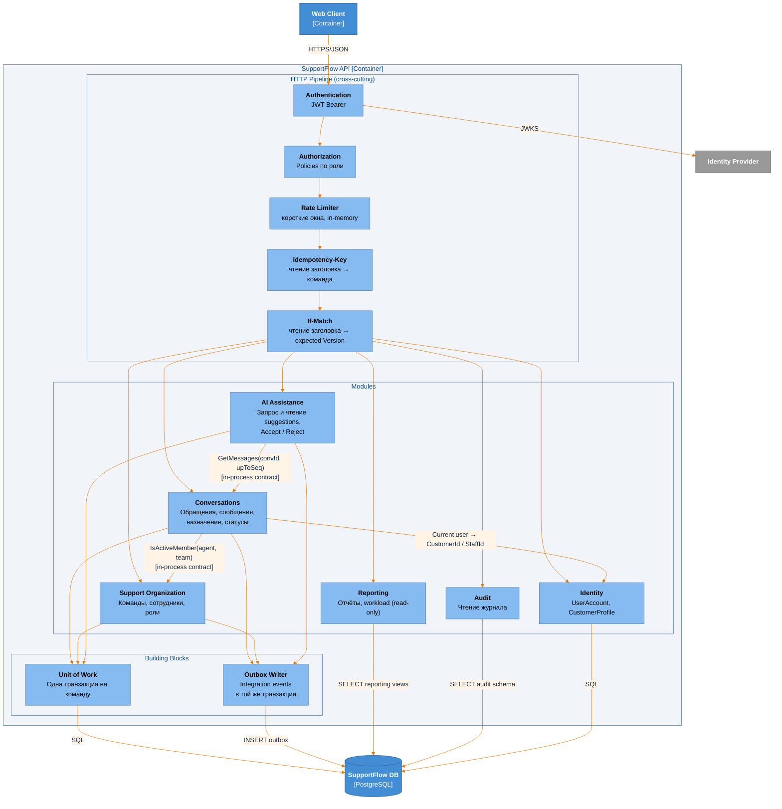
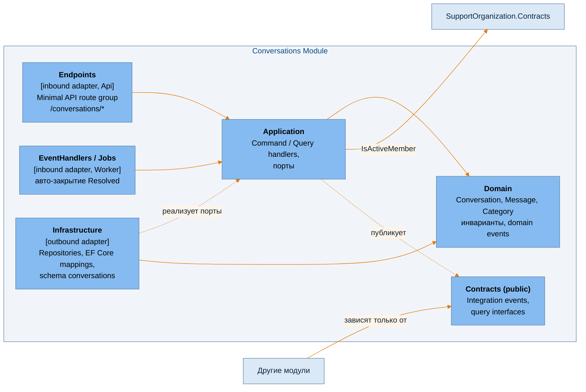
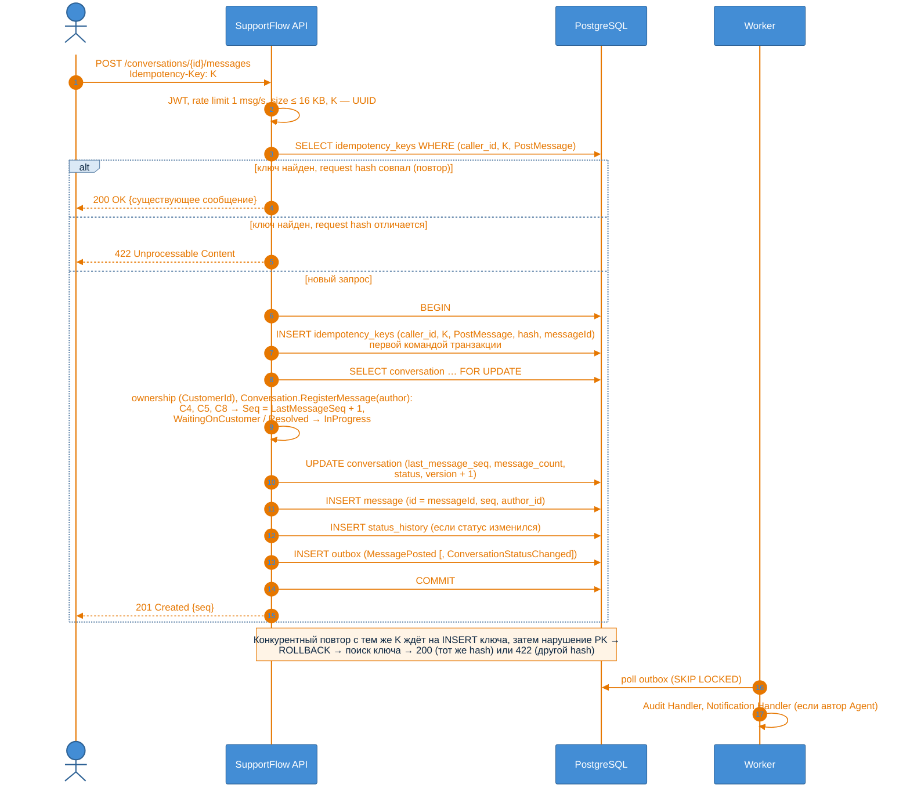
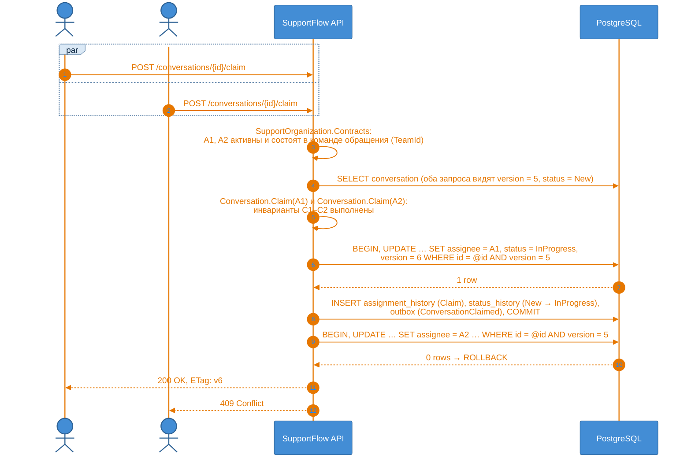
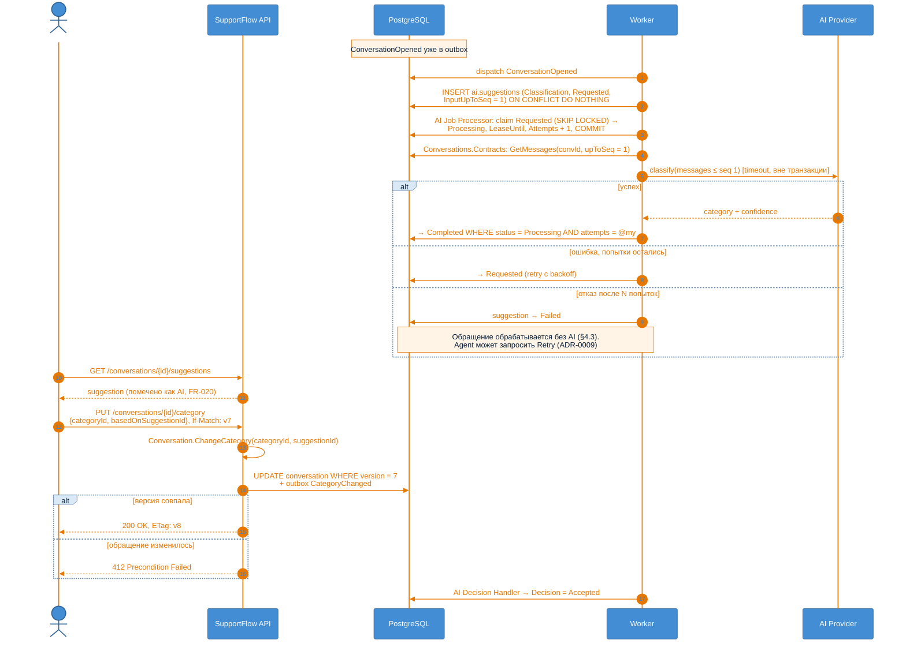

# C4 · Level 3 — Components

> **Архитектурный этап: Stage 1 — Naive modular monolith.**
>
> Связанные документы: [context.md](context.md) · [containers.md](containers.md) ·
> [architecture.md](architecture.md) · [domain-model.md](../domain-model.md)

---

## 1. SupportFlow API



| Компонент | Ответственность | ADR |
|---|---|---|
| Authentication | Проверка JWT и сопоставление `sub` с `UserAccount` | [0011](../desicions/0011-external-identity-provider.md) |
| Authorization | Policies по роли. Принадлежность (Customer видит только свои обращения, Supervisor — обращения своих команд) проверяет Application модуля: для этого нужны данные обращения | [0013](../desicions/0013-module-internal-structure.md) |
| Rate Limiter | Короткие окна (1 msg/s, API requests) в памяти instance. Суточный лимит обращений и лимит AI requests проверяются в модулях | [0012](../desicions/0012-rate-limiting.md) |
| Idempotency-Key | Только читает заголовок (нет или не UUID → 400) и передаёт ключ в команду. Дубли отсекает таблица ключей в схеме модуля | [0014](../desicions/0014-idempotency-keys-table.md) |
| If-Match | Только читает заголовок (нет → 428) и передаёт ожидаемую версию в команду. Проверка — при сохранении агрегата (несовпадение → 412) | [0007](../desicions/0007-optimistic-concurrency.md) |
| Модули | Бизнес-логика bounded contexts из domain-model. Внутреннее устройство — [architecture.md](architecture.md) | [0002](../desicions/0002-module-boundaries.md), [0013](../desicions/0013-module-internal-structure.md) |
| Unit of Work + Outbox Writer | Изменение агрегата и integration event коммитятся атомарно | [0003](../desicions/0003-transactional-outbox-postgresql-queue.md) |

У модуля Notifications нет пользовательских операций. Он полностью асинхронный и работает только в
Worker.

### 1.1 Внутреннее устройство модуля (на примере Conversations)



Слои — папки внутри проекта `SupportFlow.Modules.Conversations`, `Contracts` — отдельный проект. Правила
зависимостей — [architecture.md §3–§4](architecture.md).

### 1.2 Правила границ модулей ([ADR-0002](../desicions/0002-module-boundaries.md))

1. Модуль зависит **только от `Contracts`** другого модуля.
2. Модуль читает и пишет **только свою схему БД**, без cross-schema FK и JOIN. Исключение — `reporting`
   views ([ADR-0010](../desicions/0010-reporting-read-only-views.md)).
3. Синхронные межмодульные вызовы допускаются **только для чтения**. Изменения в другом модуле происходят
   только через integration events.
4. Правила проверяются архитектурными тестами.

### 1.3 Соглашения API

**Пагинация (§10, §13).** Ни один список не возвращается без ограничения.

| Ресурс | Пагинация | Размер страницы [Assumption] |
|---|---|---|
| Список обращений (Customer, Agent, Supervisor) | Keyset по `(last_activity_at DESC, id)`, непрозрачный `cursor` | по умолчанию 20, максимум 100 |
| История сообщений | Keyset по `Seq`: `?afterSeq=N` (новые) / `?beforeSeq=N` (старые) | по умолчанию 50, максимум 200 |
| Suggestions обращения | Последние по каждому `Kind` | — |
| Отчёты | Обязательный период и фильтр по командам Supervisor (ADR-0010) | — |

**Ограничения размера.** Тело запроса отправки сообщения и создания обращения (содержит первое сообщение) — не
больше 16 KB (сообщение ≤ 10 KB плюс метаданные) **[Assumption]**, остальные команды — не больше 4 KB
**[Assumption]**. Превышение → `413`.

**Коды ошибок.**

| Код | Когда |
|---|---|
| `400` | Неверный формат запроса, в том числе отсутствующий или не-UUID `Idempotency-Key` |
| `403` | Нет прав на ресурс (чужое обращение, обращение вне команд Supervisor) |
| `409` | Нарушение бизнес-правила или конфликт без `If-Match`: claim уже взят, недопустимый переход статуса, обращение `Closed`, лимит 1000 сообщений |
| `412` | `If-Match` не совпадает с текущей `Version` ([ADR-0007](../desicions/0007-optimistic-concurrency.md)) |
| `413` | Превышен размер запроса |
| `422` | `Idempotency-Key` уже использован с другим телом запроса ([ADR-0014](../desicions/0014-idempotency-keys-table.md)) |
| `428` | Команда изменения без `If-Match` |
| `429` | Превышен rate limit, с `Retry-After` ([ADR-0012](../desicions/0012-rate-limiting.md)) |

---

## 2. SupportFlow Worker

```mermaid
%%{init: {"theme":"base","themeVariables":{"primaryColor":"#dbe9f6","primaryTextColor":"#0b2540","primaryBorderColor":"#5d82a8","lineColor":"#e67700","secondaryColor":"#dbe9f6","tertiaryColor":"#f1f5fa","clusterBkg":"#f1f5fa","clusterBorder":"#5d82a8","titleColor":"#0b4884","edgeLabelBackground":"#fff4e6","textColor":"#e67700","actorBkg":"#438dd5","actorTextColor":"#ffffff","actorBorder":"#2e6295","actorLineColor":"#e67700","signalColor":"#e67700","signalTextColor":"#e67700","labelBoxBkgColor":"#dbe9f6","labelBoxBorderColor":"#5d82a8","labelTextColor":"#0b2540","loopTextColor":"#e67700","noteBkgColor":"#fff4e6","noteTextColor":"#0b2540","noteBorderColor":"#e67700","activationBkgColor":"#dbe9f6","attributeBackgroundColorOdd":"#ffffff","attributeBackgroundColorEven":"#f1f5fa"}}}%%
flowchart TB
    db[("<b>SupportFlow DB</b><br/>[PostgreSQL]")]
    ai["<b>AI Provider</b>"]
    np["<b>Notification Provider</b>"]

    subgraph worker["SupportFlow Worker [Container]"]
        direction TB
        disp["<b>Outbox Dispatcher</b><br/>Polling outbox, SKIP LOCKED,<br/>at-least-once delivery"]

        subgraph handlers["Integration Event Handlers (inbox dedup)"]
            h_ai["<b>AI Request Handler</b><br/>ConversationOpened →<br/>AISuggestion Requested"]
            h_dec["<b>AI Decision Handler</b><br/>CategoryChanged / PriorityChanged<br/>with suggestion → Accepted"]
            h_not["<b>Notification Handler</b><br/>Agent message, Resolved, Closed →<br/>Notification Pending"]
            h_aud["<b>Audit Handler</b><br/>значимые события → AuditEvent"]
        end

        aiw["<b>AI Job Processor</b><br/>Requested → Processing (lease),<br/>concurrency limit, timeout, retry"]
        acl_ai["<b>AI Provider Adapter</b><br/>[ACL] prompt building,<br/>response parsing"]
        ns["<b>Notification Sender</b><br/>Pending → Processing (lease),<br/>retry по NextAttemptAt"]
        acl_np["<b>Notification Provider Adapter</b><br/>[ACL], idempotency key = NotificationId"]
        sched["<b>Scheduler</b><br/>Авто-закрытие Resolved,<br/>retention, очистка outbox / inbox"]

        subgraph contracts["Contracts других модулей (in-process, только чтение)"]
            conv_c["<b>Conversations.Contracts</b><br/>GetMessages(convId, upToSeq)"]
            iam_c["<b>Identity.Contracts</b><br/>GetContactInfo(customerId)"]
        end
    end

    disp -- "SELECT … FOR UPDATE SKIP LOCKED" --> db
    disp --> h_ai & h_dec & h_not & h_aud
    h_ai & h_dec & h_not & h_aud -- "INSERT / UPDATE + inbox" --> db
    h_not -- "снимок адреса получателя" --> iam_c

    aiw -- "claim job (lease), запись результата<br/>[schema ai]" --> db
    aiw -- "сообщения до InputUpToSeq" --> conv_c
    aiw --> acl_ai -- "HTTPS, вне транзакции" --> ai

    ns -- "claim notification (lease)<br/>[schema notifications]" --> db
    ns --> acl_np -- "HTTPS, вне транзакции" --> np

    conv_c & iam_c -- "SQL своих схем" --> db
    sched -- "команды модулей" --> db

    classDef container fill:#438dd5,stroke:#2e6295,color:#fff
    classDef component fill:#85bbf0,stroke:#5d82a8,color:#000
    classDef external fill:#999,stroke:#6b6b6b,color:#fff
    class db container
    class disp,h_ai,h_dec,h_not,h_aud,aiw,acl_ai,ns,acl_np,sched,conv_c,iam_c component
    class ai,np external
```



Worker содержит те же модули, что и API. На диаграмме показаны только его inbound adapters (dispatcher,
handlers, job processors, scheduler) и контракты, через которые они читают данные других модулей.
Обработчики и jobs вызывают Application своего модуля ([architecture.md §13](architecture.md)).

**Обоснование:**

- **Обработка события и исполнение медленной работы разделены.** `AI Request Handler` только создаёт
  `AISuggestion(Requested)`: это быстро и выполняется в транзакции. Провайдера вызывает `AI Job Processor`.
  Поэтому медленный или недоступный AI не задерживает доставку остальных событий, а таблица
  `ai.suggestions` одновременно служит очередью AI-работ. Уведомления устроены так же.
- **Job берётся по lease, внешний вызов — вне транзакции** ([ADR-0003](../desicions/0003-transactional-outbox-postgresql-queue.md)).
  Короткая транзакция переводит job в `Processing` с `LeaseUntil` и увеличивает `Attempts`. Вызов AI или
  Notification Provider идёт без открытой транзакции и соединения с БД. Результат пишется условным UPDATE
  `WHERE status = 'Processing' AND attempts = @myAttempt`. Job с истёкшим lease снова доступен другим
  instances. Notification Provider получает `NotificationId` как idempotency key: повторная отправка после
  сбоя не дублирует уведомление.
- **Retention** ([§4.8](../requiremenets.md)). Scheduler удаляет `AuditEvent` старше ~1 года, доставленные
  записи outbox/inbox и ключи идемпотентности старше 48 часов
  ([ADR-0014](../desicions/0014-idempotency-keys-table.md)). Архивация обращений старше ~3 лет на Stage 1 не реализована (см.
  [containers.md](containers.md), известные ограничения).
- **Inbox** (обработанные `EventId` на каждый обработчик) превращает at-least-once доставку в
  effectively-once обработку (§4.4).
- **Ограничение параллельных вызовов AI Provider** на instance (bulkhead): §6, «ограничение concurrency
  downstream-зависимостей».
- **Retry с exponential backoff, jitter и лимитом попыток**, после которого `Failed`/`Abandoned`. Так retry
  не увеличивает нагрузку неконтролируемо (§4.4).
- **Периодические задачи** берут работу через `SKIP LOCKED` или advisory lock, поэтому несколько instances
  Worker не выполняют одну задачу дважды.
- **Adapters (ACL)** изолируют модель внешних API от домена
  ([ADR-0009](../desicions/0009-ai-assistance-separate-context.md)).

---

## 3. Dynamic diagrams

### 3.1 Customer отправляет сообщение



См. [ADR-0004](../desicions/0004-conversation-and-message-aggregates.md),
[ADR-0005](../desicions/0005-message-ordering-seq.md), [ADR-0014](../desicions/0014-idempotency-keys-table.md).

### 3.2 Два агента одновременно берут обращение



См. [ADR-0006](../desicions/0006-claim-via-conditional-update.md).

### 3.3 AI-классификация и принятие рекомендации



См. [ADR-0009](../desicions/0009-ai-assistance-separate-context.md),
[ADR-0007](../desicions/0007-optimistic-concurrency.md).

---

## 4. Отображение на код [Assumption]

```
src/
  SupportFlow.Api/                      # Host: HTTP pipeline, регистрация модулей
  SupportFlow.Worker/                   # Host: dispatcher, job processors, scheduler
  BuildingBlocks/
    SupportFlow.BuildingBlocks/         # Outbox, inbox, UoW, базовые типы domain events
  Modules/
    Conversations/
      SupportFlow.Modules.Conversations/  # папки Domain / Application / Infrastructure /
                                          #       Endpoints / EventHandlers
      SupportFlow.Modules.Conversations.Contracts/
    SupportOrganization/ …
    Identity/ …
    AIAssistance/ …
    Notifications/ …
    Audit/ …
    Reporting/ …
tests/
  SupportFlow.ArchitectureTests/        # Границы модулей и направление зависимостей слоёв
  SupportFlow.<Module>.Tests/
```

Один проект на модуль и отдельный `.Contracts` — минимальная структура, при которой правило «зависеть
только от Contracts» проверяет компилятор. Слои внутри модуля — папки, их зависимости проверяют
архитектурные тесты ([architecture.md §3](architecture.md),
[ADR-0013](../desicions/0013-module-internal-structure.md)).
