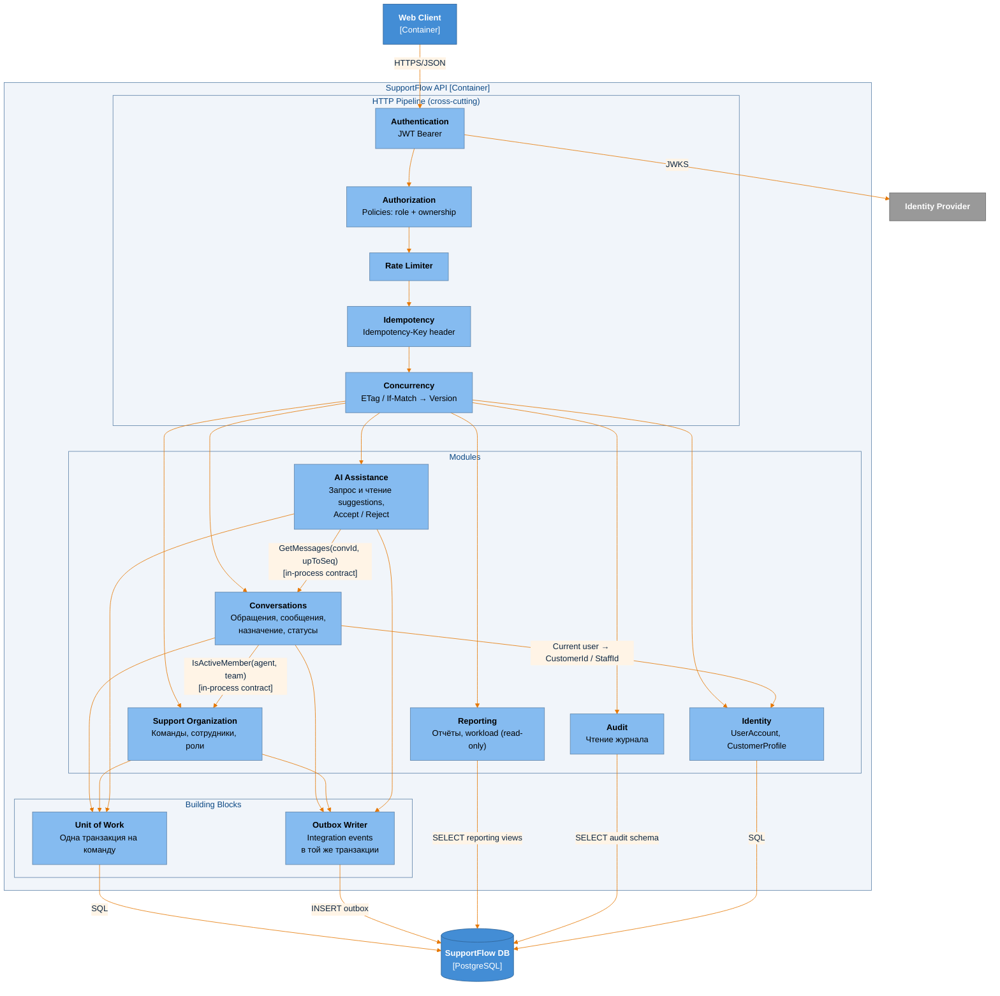
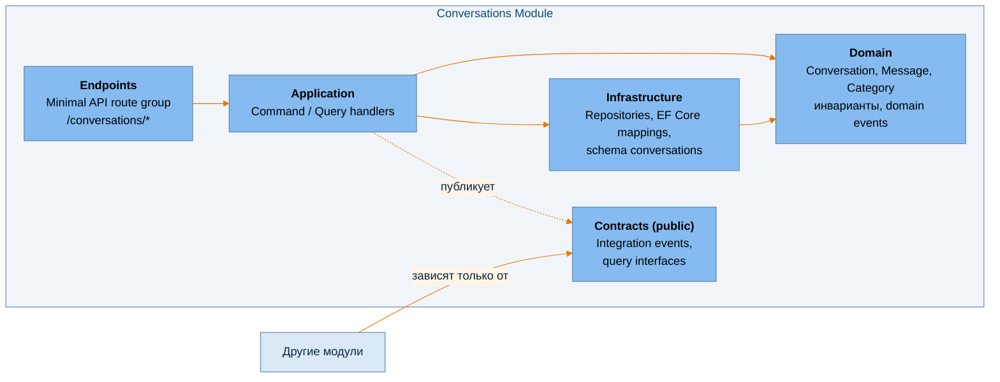
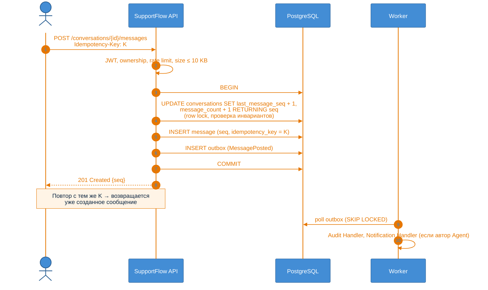
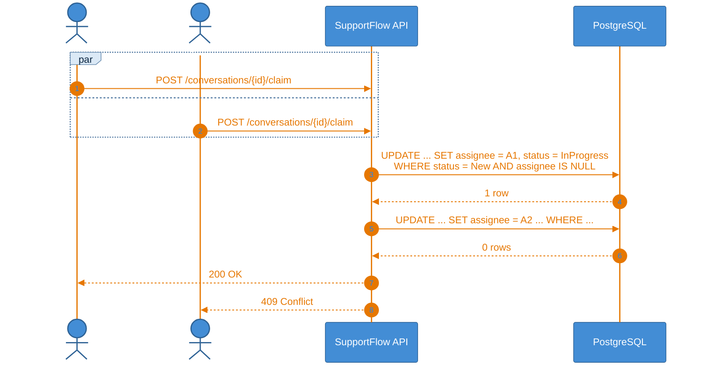
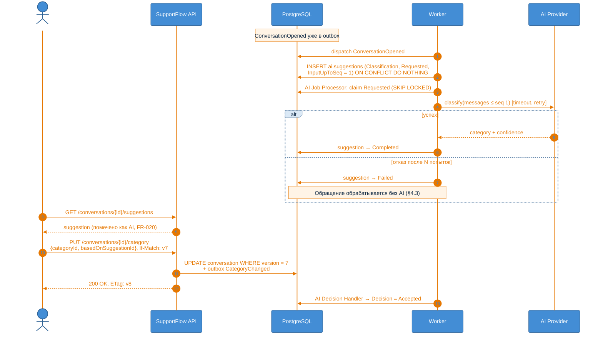

# C4 · Level 3 — Components

> **Архитектурный этап: Stage 1 — Naive modular monolith.**
>
> Связанные документы: [context.md](context.md) · [containers.md](containers.md) ·
> [domain-model.md](../domain-model.md)

---

## 1. SupportFlow API



| Компонент | Ответственность | ADR |
|---|---|---|
| Authentication | Проверка JWT и сопоставление `sub` с `UserAccount` | [0011](../desicions/0011-external-identity-provider.md) |
| Authorization | Роли и принадлежность (Customer видит только свои обращения, Supervisor — обращения своих команд) | — |
| Rate Limiter | Защита от чрезмерной нагрузки (§4.7) | [0012](../desicions/0012-rate-limiting.md) |
| Idempotency | `Idempotency-Key` для создания обращения и отправки сообщения | [0008](../desicions/0008-idempotency.md) |
| Concurrency | `ETag`/`If-Match`, соответствующий `Version` агрегата. При несовпадении → 409 | [0007](../desicions/0007-optimistic-concurrency.md) |
| Модули | Бизнес-логика bounded contexts из domain-model | [0002](../desicions/0002-module-boundaries.md) |
| Unit of Work + Outbox Writer | Изменение агрегата и integration event коммитятся атомарно | [0003](../desicions/0003-transactional-outbox-postgresql-queue.md) |

У модуля Notifications нет пользовательских операций. Он полностью асинхронный и работает только в
Worker.

### 1.1 Внутреннее устройство модуля (на примере Conversations)



### 1.2 Правила границ модулей ([ADR-0002](../desicions/0002-module-boundaries.md))

1. Модуль зависит **только от `Contracts`** другого модуля.
2. Модуль читает и пишет **только свою схему БД**, без cross-schema FK и JOIN. Исключение — `reporting`
   views ([ADR-0010](../desicions/0010-reporting-read-only-views.md)).
3. Синхронные межмодульные вызовы допускаются **только для чтения**. Изменения в другом модуле происходят
   только через integration events.
4. Правила проверяются архитектурными тестами.

---

## 2. SupportFlow Worker

```mermaid
%%{init: {"theme":"base","themeVariables":{"primaryColor":"#dbe9f6","primaryTextColor":"#0b2540","primaryBorderColor":"#5d82a8","lineColor":"#e67700","secondaryColor":"#dbe9f6","tertiaryColor":"#f1f5fa","clusterBkg":"#f1f5fa","clusterBorder":"#5d82a8","titleColor":"#0b4884","edgeLabelBackground":"#fff4e6","textColor":"#e67700","actorBkg":"#438dd5","actorTextColor":"#ffffff","actorBorder":"#2e6295","actorLineColor":"#e67700","signalColor":"#e67700","signalTextColor":"#e67700","labelBoxBkgColor":"#dbe9f6","labelBoxBorderColor":"#5d82a8","labelTextColor":"#0b2540","loopTextColor":"#e67700","noteBkgColor":"#fff4e6","noteTextColor":"#0b2540","noteBorderColor":"#e67700","activationBkgColor":"#dbe9f6","attributeBackgroundColorOdd":"#ffffff","attributeBackgroundColorEven":"#f1f5fa"}}}%%
flowchart TB
    db[("<b>SupportFlow DB</b><br/>[PostgreSQL]")]
    ai["<b>AI Provider</b>"]
    np["<b>Notification Provider</b>"]

    subgraph worker["SupportFlow Worker [Container]"]
        direction TB
        disp["<b>Outbox Dispatcher</b><br/>Polling outbox, SKIP LOCKED,<br/>at-least-once delivery"]

        subgraph handlers["Integration Event Handlers (inbox dedup)"]
            h_ai["<b>AI Request Handler</b><br/>ConversationOpened →<br/>AISuggestion Requested"]
            h_dec["<b>AI Decision Handler</b><br/>CategoryChanged / PriorityChanged<br/>with suggestion → Accepted"]
            h_not["<b>Notification Handler</b><br/>Agent message, Resolved →<br/>Notification Pending"]
            h_aud["<b>Audit Handler</b><br/>значимые события → AuditEvent"]
        end

        aiw["<b>AI Job Processor</b><br/>Берёт Requested suggestions,<br/>concurrency limit, timeout, retry"]
        acl_ai["<b>AI Provider Adapter</b><br/>[ACL] prompt building,<br/>response parsing"]
        ns["<b>Notification Sender</b><br/>Pending / retry по NextAttemptAt"]
        acl_np["<b>Notification Provider Adapter</b><br/>[ACL]"]
        sched["<b>Scheduler</b><br/>Авто-закрытие Resolved,<br/>очистка outbox / inbox"]
    end

    disp -- "SELECT … FOR UPDATE SKIP LOCKED" --> db
    disp --> h_ai & h_dec & h_not & h_aud
    h_ai & h_dec & h_not & h_aud -- "INSERT / UPDATE + inbox" --> db

    aiw -- "claim jobs, GetMessages(upToSeq)" --> db
    aiw --> acl_ai -- "HTTPS" --> ai

    ns -- "claim notifications" --> db
    ns --> acl_np -- "HTTPS" --> np

    sched -- "SQL" --> db

    classDef container fill:#438dd5,stroke:#2e6295,color:#fff
    classDef component fill:#85bbf0,stroke:#5d82a8,color:#000
    classDef external fill:#999,stroke:#6b6b6b,color:#fff
    class db container
    class disp,h_ai,h_dec,h_not,h_aud,aiw,acl_ai,ns,acl_np,sched component
    class ai,np external
```



**Обоснование:**

- **Обработка события и исполнение медленной работы разделены.** `AI Request Handler` только создаёт
  `AISuggestion(Requested)`: это быстро и выполняется в транзакции. Провайдера вызывает `AI Job Processor`.
  Поэтому медленный или недоступный AI не задерживает доставку остальных событий, а таблица
  `ai.suggestions` одновременно служит очередью AI-работ. Уведомления устроены так же.
- **Inbox** (обработанные `EventId` на каждый обработчик) превращает at-least-once доставку в
  effectively-once обработку (§4.4).
- **Ограничение параллельных вызовов AI Provider** на instance (bulkhead): §6, «ограничение concurrency
  downstream-зависимостей».
- **Retry с exponential backoff, jitter и лимитом попыток**, после которого `Failed`/`Abandoned`. Так retry
  не увеличивает нагрузку неконтролируемо (§4.4).
- **Периодические задачи** берут работу через `SKIP LOCKED` или advisory lock, поэтому несколько instances
  Worker не выполняют одну задачу дважды.
- **Adapters (ACL)** изолируют модель внешних API от домена
  ([ADR-0009](../desicions/0009-ai-assistance-separate-context.md)).

---

## 3. Dynamic diagrams

### 3.1 Customer отправляет сообщение



См. [ADR-0004](../desicions/0004-conversation-and-message-aggregates.md),
[ADR-0005](../desicions/0005-message-ordering-seq.md), [ADR-0008](../desicions/0008-idempotency.md).

### 3.2 Два агента одновременно берут обращение



См. [ADR-0006](../desicions/0006-claim-via-conditional-update.md).

### 3.3 AI-классификация и принятие рекомендации



См. [ADR-0009](../desicions/0009-ai-assistance-separate-context.md),
[ADR-0007](../desicions/0007-optimistic-concurrency.md).

---

## 4. Отображение на код [Assumption]

```
src/
  SupportFlow.Api/                      # Host: HTTP pipeline, регистрация модулей
  SupportFlow.Worker/                   # Host: dispatcher, job processors, scheduler
  BuildingBlocks/
    SupportFlow.BuildingBlocks/         # Outbox, inbox, UoW, базовые типы domain events
  Modules/
    Conversations/
      SupportFlow.Conversations/        # Domain + Application + Infrastructure + Endpoints
      SupportFlow.Conversations.Contracts/
    SupportOrganization/ …
    Identity/ …
    AIAssistance/ …
    Notifications/ …
    Audit/ …
    Reporting/ …
tests/
  SupportFlow.ArchitectureTests/        # Проверка правил границ модулей
  SupportFlow.<Module>.Tests/
```

Один проект на модуль и отдельный `.Contracts` — минимальная структура, при которой правило «зависеть
только от Contracts» проверяет компилятор.
