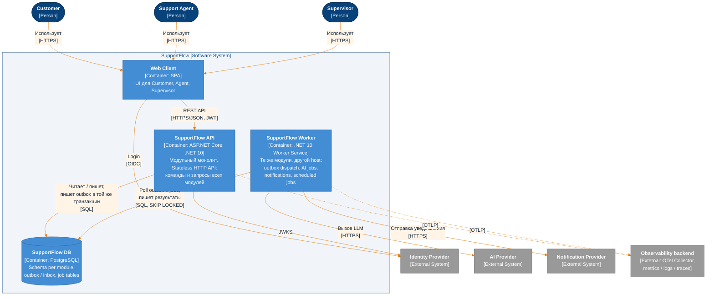
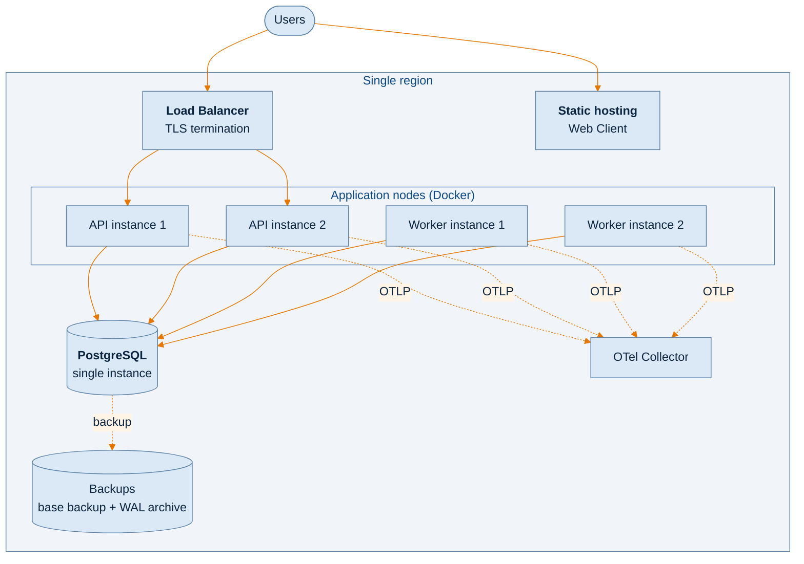

# C4 · Level 2 — Containers

> **Архитектурный этап: Stage 1 — Naive modular monolith.**
> Модульный монолит в двух host-процессах (API + Worker) и одна PostgreSQL с transactional outbox.
>
> Связанные документы: [context.md](context.md) · [components.md](components.md) ·
> [architecture.md](architecture.md) · [domain-model.md](../domain-model.md)

## Диаграмма

API и Worker не вызывают друг друга напрямую: единственный канал между ними — PostgreSQL (outbox и job
tables).

## Контейнеры

| Контейнер | Технология | Ответственность |
|---|---|---|
| **Web Client** [Assumption] | SPA | UI для трёх ролей. В репозитории пока отсутствует. |
| **SupportFlow API** | ASP.NET Core minimal API, .NET 10 | Все синхронные операции (команды и запросы). Проверка JWT, авторизация, rate limiting, idempotency, optimistic concurrency. Пишет domain changes и integration events в outbox одной транзакцией. |
| **SupportFlow Worker** | .NET Worker Service | Доставка событий из outbox обработчикам, AI jobs, отправка уведомлений, периодические задачи (авто-закрытие `Resolved`, retention audit, очистка outbox/inbox и ключей идемпотентности). |
| **SupportFlow DB** | PostgreSQL | Единственное хранилище: данные модулей (schema per module), outbox, inbox, job tables. |

## Ключевые решения

| Решение | ADR |
|---|---|
| Один код, два host-процесса: API и Worker | [ADR-0001](../desicions/0001-modular-monolith-api-and-worker.md) |
| Модули изолированы: schema per module, зависимость только от Contracts | [ADR-0002](../desicions/0002-module-boundaries.md) |
| Transactional outbox и очередь на PostgreSQL (`SKIP LOCKED`), без брокера | [ADR-0003](../desicions/0003-transactional-outbox-postgresql-queue.md) |
| Внешний Identity Provider, JWT, stateless API | [ADR-0011](../desicions/0011-external-identity-provider.md) |
| Rate limiting | [ADR-0012](../desicions/0012-rate-limiting.md) |
| Внутреннее устройство модулей | [ADR-0013](../desicions/0013-module-internal-structure.md), [architecture.md](architecture.md) |

Кратко:

- **Почему Worker отдельный процесс.** AI-вызовы длятся до 10 s (§4.1), а уведомления приходят пачками.
  Если выполнять их внутри API, они конкурируют с интерактивными запросами за thread pool и пул соединений
  к БД. Требование §4.2 прямо называет AI processing и notifications кандидатами на независимое
  масштабирование.
- **Почему нет брокера.** Оценочная нагрузка: ~13 writes/sec в среднем, ~130 в пике (§5.3). Такой поток
  событий PostgreSQL обрабатывает с запасом. Outbox в той же транзакции гарантирует, что события не
  теряются (§4.4), без распределённой записи «БД + брокер».
- **Почему API stateless.** Отказ одного instance не должен влиять на пользователей (§4.3). Состояние
  хранится только в PostgreSQL, аутентификация — только по JWT.

## Deployment

- Минимум 2 instance API и 2 instance Worker, чтобы отказ одного instance не прерывал обслуживание (§4.3).
- API и Worker — два образа одного репозитория: `supportflow-api` и `supportflow-worker` (ADR-0017).
- Миграции применяет отдельный шаг `supportflow-api migrate` до запуска новой версии; API и Worker схему не
  меняют (ADR-0017).
- Оркестратор не выбран (§13). Локальный production-like запуск — `deploy/docker-compose.yml`; Keycloak в нём
  только локально заменяет Identity Provider, выбор IdP открыт (ADR-0011).
- Один регион (§11).

## Observability

API и Worker отправляют metrics, logs и traces в OTel Collector (OTLP). Correlation ID проходит через
HTTP-запрос, outbox-событие и обработчики, так что асинхронную цепочку можно проследить одним trace.

Trace context (W3C `traceparent`) сохраняется в строке outbox и восстанавливается dispatcher'ом, поэтому
HTTP-запрос, доставка события и обработчики образуют один trace. Correlation ID — trace id. API и Worker отдают
`/health/live` (процесс жив, без зависимостей) и `/health/ready` (доступна PostgreSQL) для проб оркестратора.

Минимальный набор метрик Stage 1 [Assumption]:

| Метрика | Зачем |
|---|---|
| Latency p95/p99 и RPS по endpoint | Проверка целей §4.1 |
| Outbox lag: возраст самой старой недоставленной записи | Задержка асинхронной обработки, отставание dispatcher |
| Глубина очередей jobs: `ai.suggestions` в `Requested`/`Processing`, `notifications` в `Pending` | Перегрузка Worker, отказ провайдеров |
| AI: latency по `Kind`, доля `Failed`, количество retry | Цели §4.1 для AI, деградация провайдера |
| Notifications: доля `Abandoned` | Отказ Notification Provider |
| Ответы `409` / `412` / `429` | Конкуренция за обращения, срабатывание лимитов |
| PostgreSQL: активные соединения, lock waits, размер таблиц | Главный общий ресурс Stage 1 |

## Известные ограничения этого этапа

Это свойства текущей архитектуры. Их нужно измерить нагрузочным тестированием, прежде чем что-либо менять
(§12.3, §16).

| Ограничение | Следствие |
|---|---|
| PostgreSQL — единственный instance | Single point of failure. При его отказе недоступна вся система. Восстановление только из backup (RPO/RTO не определены). |
| Вся нагрузка (OLTP, outbox polling, job tables, отчёты) на одной БД | Отчёты и фоновая обработка конкурируют с интерактивными запросами за ресурсы БД. |
| Outbox доставляется polling'ом | Задержка асинхронной обработки не меньше интервала опроса. Постоянный фоновый поток запросов к БД. |
| Per-second rate limit хранится в памяти instance | При N instances API фактический лимит в N раз мягче ([ADR-0012](../desicions/0012-rate-limiting.md)). |
| UI получает новые сообщения только через polling [Assumption] | Дополнительный read traffic, не учтённый в модели §5.4: при каждом открытом обращении и интервале опроса T секунд — по запросу `GET …/messages?afterSeq=N` на обращение каждые T секунд. Нужно отдельно учесть в нагрузочных тестах. |
| Retention реализована частично | Scheduler удаляет audit старше ~1 года и доставленные outbox/inbox. Архивация обращений, сообщений и AI results старше ~3 лет (§4.8) не реализована: её понадобится добавить до того, как данные достигнут этого возраста. Вероятный путь — partitioning `messages` по времени (domain-model §12). |
