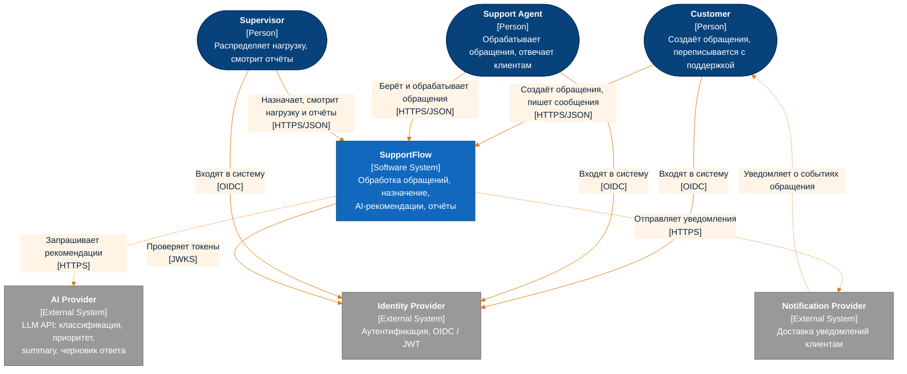

# C4 · Level 1 — System Context

> **Архитектурный этап: Stage 1 — Naive modular monolith.**
> Документ описывает только текущее состояние архитектуры. Изменения фиксируются через ADR
> в `docs/desicions/`.
>
> Связанные документы: [containers.md](containers.md) · [components.md](components.md) ·
> [architecture.md](architecture.md) · [domain-model.md](../domain-model.md) ·
> [requiremenets.md](../requiremenets.md)

## Легенда

| Элемент | Обозначение |
|---|---|
| Person | тёмно-синий |
| Система SupportFlow | синий |
| Внешняя система | серый |
| Сплошная стрелка | синхронное взаимодействие |
| Пунктирная стрелка | асинхронное взаимодействие |

## Диаграмма

## Элементы

| Элемент | Тип | Роль | Требования |
|---|---|---|---|
| Customer | Person | Создаёт обращения, пишет сообщения, смотрит историю своих обращений | FR-001…FR-004 |
| Support Agent | Person | Берёт обращения в работу, отвечает, меняет статус, категорию и приоритет | FR-005…FR-010 |
| Supervisor | Person | Назначает и переназначает обращения, смотрит нагрузку и отчёты | FR-011…FR-015 |
| SupportFlow | Software System | Разрабатываемая система | — |
| Identity Provider | External | Аутентификация пользователей, выдача JWT | MVP scope: authentication |
| AI Provider | External | Внешний LLM API | FR-016…FR-019 |
| Notification Provider | External | Доставка уведомлений клиентам | FR-021 |

## Обоснование

- **AI — внешняя система, а не Person.** В требованиях AI перечислен среди акторов. Но на уровне
  системного контекста это внешний сервис, который вызывает SupportFlow, а не пользователь, который
  инициирует действия. Итоговые решения принимает Support Agent (§2.4, FR-020).
- **Взаимодействие с AI и Notification Provider асинхронное** (пунктир). Оба некритичны: их недоступность
  не должна блокировать работу с обращениями (§4.3). Поэтому ни один пользовательский HTTP-запрос не ждёт
  ответа этих систем.
- **Identity Provider внешний** ([ADR-0011](../desicions/0011-external-identity-provider.md)).
  Аутентификация — generic subdomain. SupportFlow только проверяет JWT и сопоставляет пользователя со
  своими ролями.
- **Одна система, а не набор сервисов.** SupportFlow развёртывается как модульный монолит
  ([ADR-0001](../desicions/0001-modular-monolith-api-and-worker.md)). Внутреннее устройство показано в
  [containers.md](containers.md).
