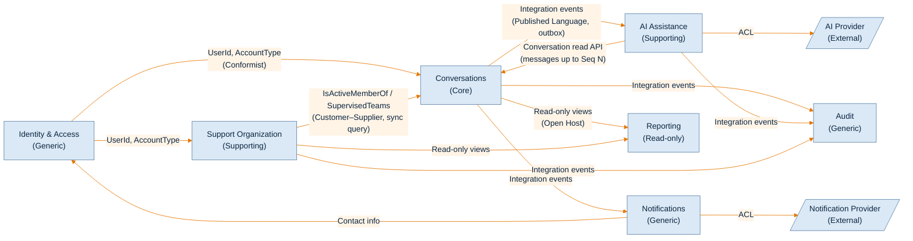
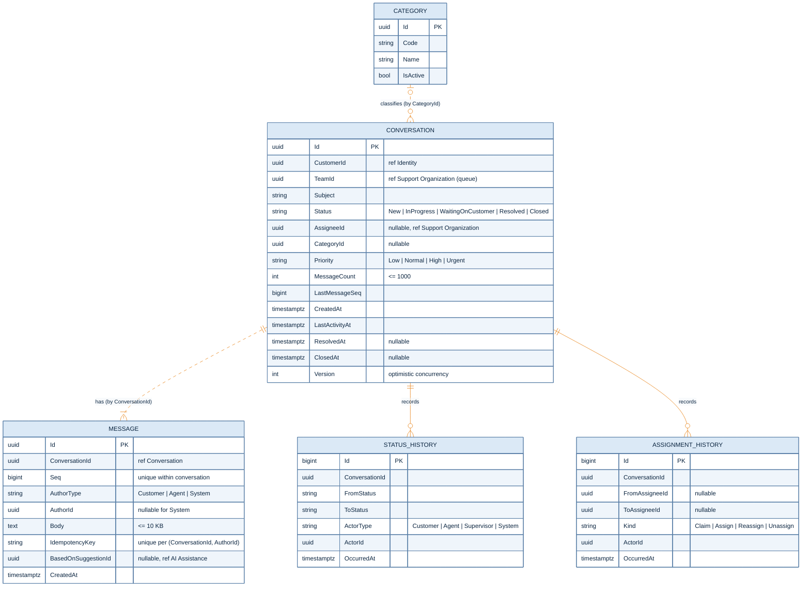
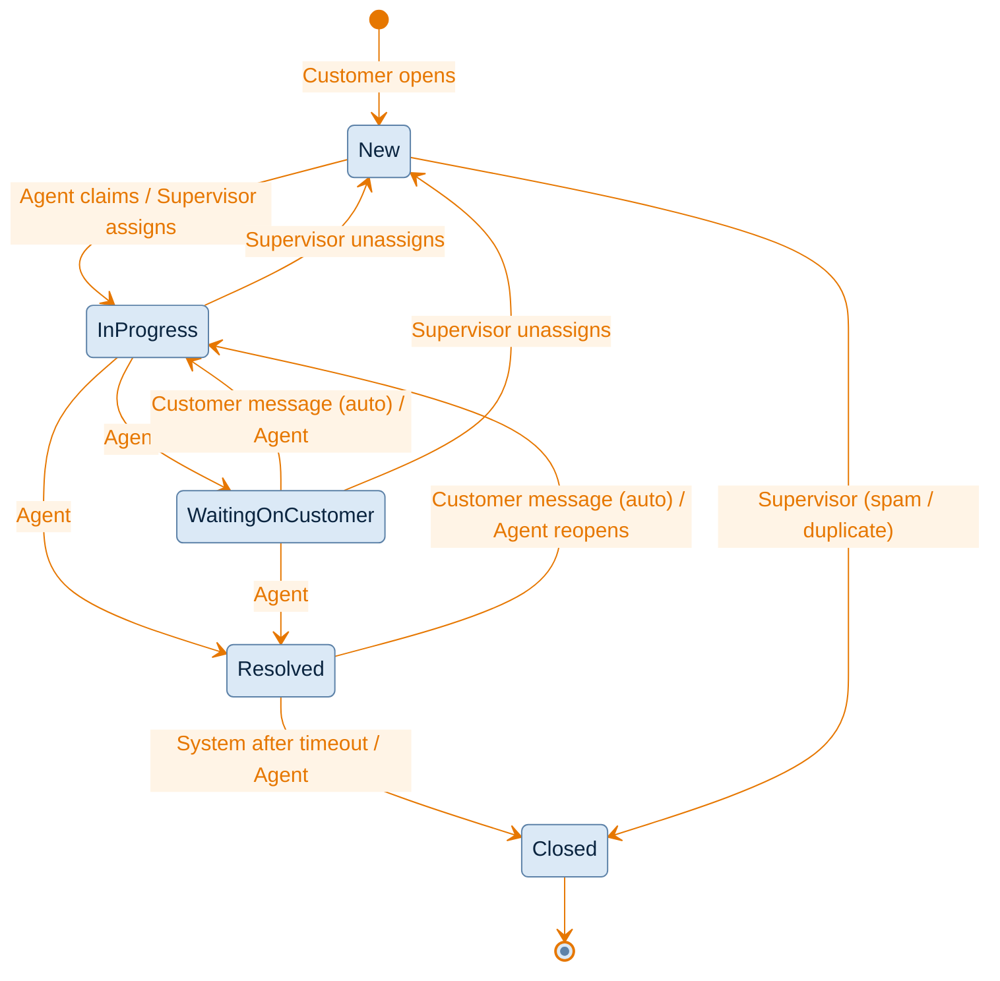
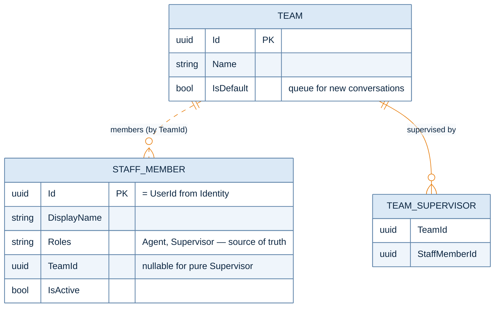
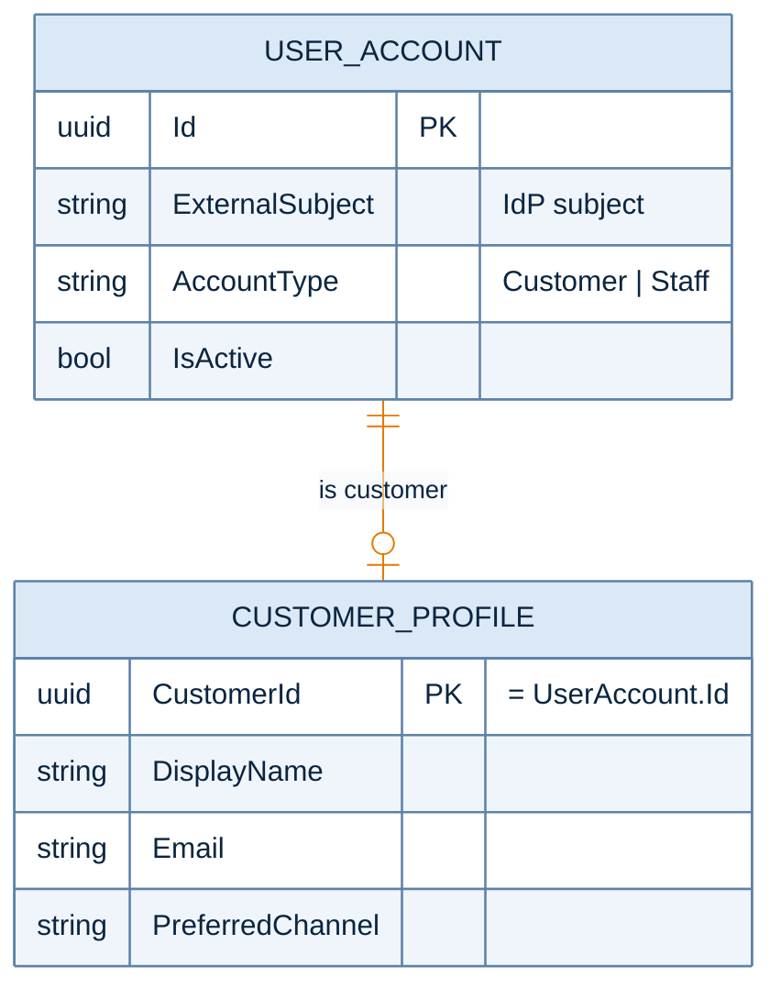
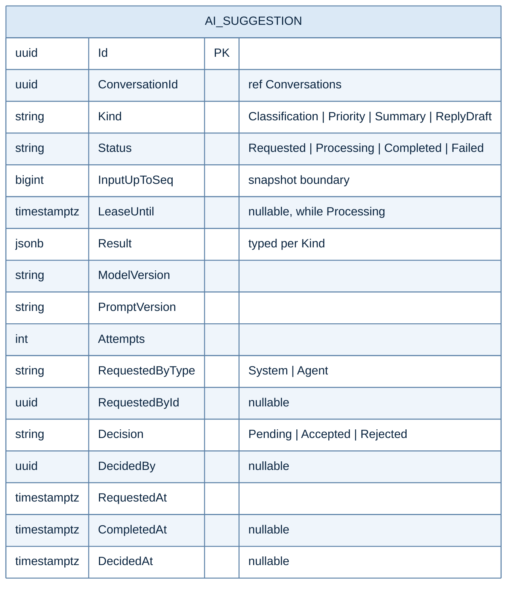
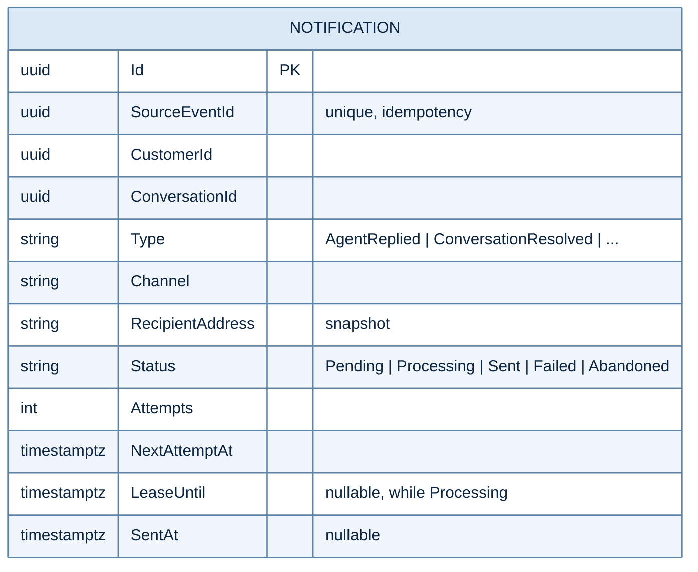
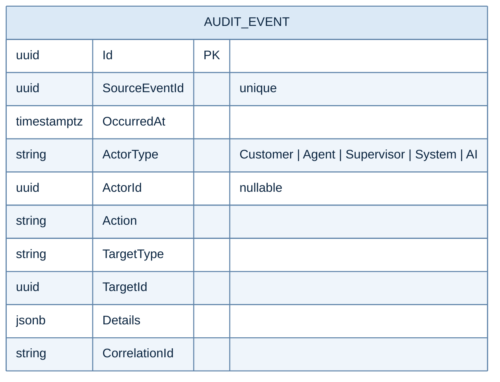
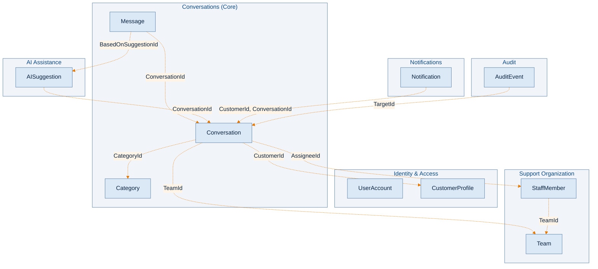

# SupportFlow — Domain Model

> Статус: **draft v1**. Документ фиксирует границы контекстов, агрегаты, сущности, их связи и инварианты,
> а также обоснование каждого решения. Решения, не выведенные напрямую из `requiremenets.md`, помечены как
> **[Assumption]** и должны быть подтверждены или оформлены в ADR (`docs/desicions/`).

---

## 0. Принципы моделирования

1. **Агрегат = граница транзакционной согласованности.** В агрегат попадает только то, что нужно для
   проверки его инвариантов в одной транзакции. Всё остальное — отдельный агрегат со ссылкой по ID.
2. **Между агрегатами — ссылки только по ID**, без навигационных свойств. Между bounded contexts — только
   по ID и через публичный контракт модуля (application API или integration events).
3. **Одна транзакция — один агрегат**, за единственным осознанным исключением (Conversation + Message,
   см. §3.3), обоснованным инвариантами порядка и лимитов сообщений.
4. **Изменения состояния публикуются как domain events** через transactional outbox (§4.4 — надёжность,
   §4.3 — отказ AI/Notification Provider не должен ломать основной поток).
5. **Согласованность определяется per operation** (§4.5): strong — внутри агрегата, eventual — между
   агрегатами и контекстами.
6. **AI никогда не изменяет состояние обращения напрямую** (§2.4, FR-020). Он только создаёт предложения,
   которые принимает или отклоняет человек.

---

## 1. Ubiquitous Language

| Термин | Значение |
|---|---|
| **Conversation** (обращение) | Запрос клиента в поддержку с его жизненным циклом: статус, категория, приоритет, исполнитель. |
| **Message** | Неизменяемое сообщение в рамках обращения от Customer, Agent или System. |
| **Seq** | Порядковый номер сообщения внутри обращения (1, 2, 3, …). Единственный источник порядка отображения. |
| **Team / Queue** | Команда сотрудников и одновременно очередь обращений, за которую она отвечает. **[Assumption]** |
| **Staff Member** | Сотрудник поддержки: Agent и/или Supervisor. |
| **Assignee** | Текущий Agent, ответственный за обращение. Не больше одного в каждый момент времени. |
| **Claim** | Agent сам берёт свободное обращение в работу (FR-006). |
| **Assign / Reassign** | Supervisor назначает или переназначает обращение (FR-012, FR-013). |
| **Unassigned (свободное) обращение** | Обращение в статусе `New` без Assignee. |
| **AI Suggestion** | Результат работы AI (классификация, приоритет, summary, черновик ответа). Сам по себе ничего не меняет. |
| **Decision** | Реакция сотрудника на AI Suggestion: Accepted или Rejected. |
| **Workload** | Количество активных обращений, назначенных на Agent. Вычисляемая величина, не хранимое поле. |

---

## 2. Bounded Contexts

### 2.1 Обзор

| Context | Тип | Ответственность | Ключевые агрегаты |
|---|---|---|---|
| **Conversations** | **Core** | Жизненный цикл обращения, сообщения, назначение, статусы, категории, приоритеты | `Conversation`, `Message`, `Category` |
| **Support Organization** | Supporting | Сотрудники, команды, роли в поддержке, зона ответственности Supervisor | `Team`, `StaffMember` |
| **Identity & Access** | Generic | Учётные записи, аутентификация, роли, профиль клиента | `UserAccount`, `CustomerProfile` |
| **AI Assistance** | Supporting | Запросы к AI, хранение результатов, решения сотрудников по ним | `AISuggestion` |
| **Notifications** | Generic | Доставка уведомлений клиенту через внешний провайдер | `Notification` |
| **Audit** | Generic | Неизменяемый журнал значимых действий | `AuditEvent` |
| **Reporting** | Supporting (read-only) | Operational reports и workload для Supervisor | Нет агрегатов, только read models |

**Почему именно такое разбиение:**

- **Conversations — core domain.** Здесь сосредоточены бизнес-правила: кто и когда может взять обращение,
  допустимые переходы статусов, порядок и лимиты сообщений. Именно здесь находятся требования конкурентного
  доступа из §4.5.
- **Support Organization отделён от Conversations.** Состав команд и роли меняются редко, по другим
  причинам и другими людьми (администрирование), чем обращения (операционная работа). Conversations только
  спрашивает, может ли сотрудник X работать с обращениями команды T.
- **Identity & Access — generic.** Аутентификация, скорее всего, будет делегирована внешнему IdP. Домен
  не должен зависеть от формы учётных записей: он получает `UserId` и роль.
- **AI Assistance — отдельный контекст**, а не часть Conversations. Причины:
  1. AI медленный и ненадёжный (§13), обрабатывается асинхронно workers и масштабируется независимо (§4.2).
  2. Жёсткое требование FR-020: AI-рекомендации должны быть отличимы от решений человека. Разные контексты
     делают это различие структурным, а не соглашением в коде.
  3. AI results хранятся 3 года и составляют заметный объём (~300k/day × 3 KB). Данные с таким профилем
     удобно иметь в собственной схеме.
- **Notifications и Audit — generic** и являются чистыми потребителями событий. Их отказ не влияет на
  основной поток (§4.3).
- **Reporting — отдельный read-only контекст.** На MVP он читает основную БД (§4.9), но через явный
  контракт (read-only views), а не через внутренние таблицы Conversations.

### 2.2 Context Map



Стрелка показывает направление зависимости: от upstream (поставщик данных или контракта) к downstream
(потребитель).

| Связь | Паттерн | Обоснование |
|---|---|---|
| Conversations → AI / Notifications / Audit | **Published Language** через integration events и outbox | Асинхронная связь. Отказ downstream не блокирует запись обращения (§4.3). Outbox гарантирует, что событие не потеряется (§4.4). |
| Support Organization → Conversations | **Customer–Supplier**, синхронный in-process запрос | При assign/claim нужно проверить, что Agent активен и состоит в команде. Это чтение, а не транзакция по двум агрегатам. Гонка «Agent исключён из команды в ту же миллисекунду» допустима. |
| AI → Conversations | **Open Host Service** (read API) | AI worker читает сообщения до указанного `Seq`. Прямой SQL к таблицам Conversations запрещён (§12.2). |
| AI → AI Provider, Notifications → Provider | **Anti-Corruption Layer** | Модели внешних API не проникают в домен. Провайдер можно заменить. |
| Conversations → Reporting | **Open Host**: read-only SQL views, опубликованные модулем Conversations | Компромисс для MVP (§4.9): Reporting читает основную БД, но через стабильный контракт, а не через внутренние таблицы. Позже views заменяются projection, питаемой событиями. |

---

## 3. Conversations Context (Core)

### 3.1 Модель



**Легенда:** сплошная линия означает запись внутри одной транзакции агрегата. Пунктир означает ссылку по ID
между разными агрегатами.

### 3.2 Aggregate: `Conversation`

**Состав:** корень агрегата с полями выше. `StatusHistory` и `AssignmentHistory` являются
**append-only записями**, которые порождаются агрегатом в той же транзакции. Это не часть загружаемого
состояния: агрегат их никогда не читает.

**Почему Conversation является агрегатом, а не просто таблицей:** почти все требования конкурентного доступа
из §4.5 являются инвариантами одного обращения. Если сделать его единицей блокировки и версионирования,
эти требования выполняются одной транзакцией с одной строкой.

**Инварианты:**

| # | Инвариант | Источник |
|---|---|---|
| C1 | `Status = New` ⇔ `AssigneeId IS NULL`. В статусах `InProgress`, `WaitingOnCustomer` и `Resolved` Assignee обязателен. В `Closed` сохраняется последний Assignee для отчётов. | FR-006, FR-012 |
| C2 | Claim возможен только из `New`. Одновременно успешен ровно один claim. | FR-006, §4.5 |
| C3 | Переходы статусов разрешены только по state machine (§3.4). | FR-008 |
| C4 | `MessageCount ≤ 1000`. | §4.7 |
| C5 | В `Closed` обращение не принимает сообщений и изменений. | [Assumption] |
| C6 | `LastMessageSeq` монотонно растёт, без пропусков и повторов. | §4.6 |
| C7 | Сообщение от имени Agent может отправить только текущий Assignee. | [Assumption], FR-007 |
| C8 | Сообщение от имени Customer может отправить только владелец обращения (`CustomerId`). | FR-002 |
| C9 | Category и Priority меняет только Staff (Agent или Supervisor), но не AI и не Customer. | FR-009, FR-010, FR-020 |

**Команды и события:**

| Команда | Актор | Domain Event |
|---|---|---|
| `Open(customerId, teamId, subject, firstMessage)` | Customer | `ConversationOpened`, `MessagePosted` |
| `Claim(agentId)` | Agent | `ConversationClaimed` |
| `Assign(agentId)` / `Reassign(agentId)` | Supervisor | `ConversationAssigned` |
| `Unassign()` | Supervisor | `ConversationUnassigned` |
| `ChangeStatus(to)` | Agent, System | `ConversationStatusChanged` |
| `ChangeCategory(categoryId, basedOnSuggestionId?)` | Agent | `ConversationCategoryChanged` |
| `ChangePriority(priority, basedOnSuggestionId?)` | Agent | `ConversationPriorityChanged` |
| `RegisterMessage(author)` → `Seq` | Customer, Agent | `MessagePosted` (вместе с созданием Message) |

**Почему текущий Assignee хранится в Conversation, а не только в Assignment:**
требование «два сотрудника не должны одновременно успешно взять одно обращение» тогда выполняется проверкой
в агрегате (`Claim()` разрешён только из `New` без Assignee) и одним условным UPDATE по версии
([ADR-0006](desicions/0006-claim-via-conditional-update.md)):

```sql
-- после Conversation.Claim(agentId) на загруженном агрегате с version = @loaded
UPDATE conversations
SET assignee_id = @agent, status = 'InProgress', version = version + 1
WHERE id = @id AND version = @loaded;
-- 0 rows → 409 Conflict (обращение изменилось, кто-то успел раньше)
```

Если бы Assignment был единственным источником истины (отдельные строки назначений), инвариант «не больше
одного активного назначения» пришлось бы обеспечивать partial unique index или блокировками по нескольким
строкам. Поэтому `AssignmentHistory` используется только как журнал, для отчётов и аудита.

**Почему `Priority` — enum, а `Category` — справочник:**
приоритет является частью бизнес-логики (сортировка очередей, в будущем SLA), и его значения стабильны.
Категории — бизнес-настройка, которая будет меняться без деплоя.

### 3.3 Aggregate: `Message`

**Решение:** `Message` является **отдельным агрегатом**, а не дочерней сущностью `Conversation`.

**Обоснование:**
- В обращении может быть до 1000 сообщений (§4.7), а за 3 года накапливается ~1.5 TB payload (§9). Загрузка
  коллекции сообщений ради смены статуса недопустима по latency (p95 ≤ 200 ms).
- Сообщение **неизменяемо**. Собственных инвариантов, требующих транзакции, кроме «создано корректно»,
  у него нет.
- Таблица Message является главным кандидатом на partitioning и archival (§13). Независимый агрегат
  упрощает это.

**Осознанное исключение из правила «один агрегат на транзакцию»:**
отправка сообщения в одной транзакции делает две вещи:
1. `Conversation.RegisterMessage(author)` проверяет C4, C5, C7 и C8, инкрементирует `LastMessageSeq`
   и `MessageCount` и выдаёт `Seq`;
2. создаёт `Message` с этим `Seq`.

Это допустимо, потому что оба агрегата принадлежат одному контексту и одной БД, а инварианты порядка (C6)
и лимита (C4) по сути принадлежат Conversation. Альтернатива — eventual consistency, когда Message создаётся
первым, а счётчик обновляется асинхронно. Она не позволяет гарантировать ни лимит, ни однозначный порядок.

**Порядок сообщений (§4.6):**
- Порядок определяется **только `Seq`**, а не `CreatedAt`. Часы разных instance не синхронизированы, и
  одинаковые timestamps неизбежны.
- Конкурентные отправки в одно обращение сериализуются на строке `Conversation`: транзакция отправки
  загружает её через `SELECT … FOR UPDATE` ([ADR-0004](desicions/0004-conversation-and-message-aggregates.md)).
  В среднем в обращении ~7 сообщений, а поток на одно обращение измеряется единицами в минуту, поэтому
  contention пренебрежимо мал.
- Итоговое правило для пользователя: **сообщения упорядочены в порядке коммита их регистрации в обращении**.

**Дубли из-за retry (§4.5):**
клиент передаёт `IdempotencyKey`. Уникальность `(ConversationId, AuthorId, IdempotencyKey)` гарантирует, что
повтор вернёт уже созданное сообщение того же автора, а не второе
([ADR-0008](desicions/0008-idempotency.md)). Если retry прошёл после успешного коммита, ответом будет
тот же `Message`.

**Связь с AI:** `BasedOnSuggestionId` фиксирует, что Agent отправил ответ на основе AI-черновика. Автором
всё равно остаётся Agent, потому что отправку выполняет человек (§2.4). Это даёт трассируемость для FR-020
и метрики качества AI.

### 3.4 Status State Machine



**[Assumption]** Набор статусов и переходов не задан в требованиях. Обоснование предложенного набора:

- `New` явно отделён от `InProgress`, потому что именно `New` определяет «свободное» обращение для FR-006.
- `WaitingOnCustomer` нужен для корректного «времени обработки» (§4.9): время ожидания клиента не должно
  засчитываться агенту.
- `Resolved` и `Closed` разделены, чтобы у клиента было окно для «не помогло» без создания нового
  обращения. `Closed` — терминальный статус, и новое сообщение после него требует нового обращения.
- Автоматические переходы (реакция на сообщение Customer, закрытие по таймауту) выполняются от имени
  **System** и пишутся в `StatusHistory` с `ActorType = System`.

### 3.5 Aggregate: `Category`

Небольшой справочный агрегат. Категорию не удаляют, а деактивируют (`IsActive = false`), потому что на неё
ссылаются исторические обращения. Изменяет её администратор, эта функция находится вне MVP-актор-модели и
пока задаётся seed-данными.

### 3.6 Что **не** является инвариантом домена

| Правило | Где обеспечивается | Почему не в агрегате |
|---|---|---|
| ≤ 10 обращений от Customer в сутки | Application: `COUNT` под advisory lock клиента в транзакции создания ([ADR-0012](desicions/0012-rate-limiting.md)) | Это правило о множестве агрегатов. Его проверка в домене потребовала бы транзакции по всем обращениям клиента. Это защита от нагрузки (§4.7), а не бизнес-правило. |
| ≤ 1 сообщения в секунду от Customer | Rate limiter | То же. |
| Agent активен и состоит в команде обращения | Application service через запрос к Support Organization | Данные другого контекста. Проверка выполняется до вызова агрегата, а редкая гонка допустима. |
| Размер сообщения ≤ 10 KB | **Домен** (value object `MessageBody`) и лимит на размер request | Это как раз инвариант сообщения, но дополнительно ограничивается и на входе. |

---

## 4. Support Organization Context



**Aggregate `Team`:** команда и список её Supervisor. Инвариант: у команды есть хотя бы один Supervisor
**[Assumption]**.

**Aggregate `StaffMember`:** сотрудник, его роли и команда. Инвариант: Agent состоит ровно в одной команде
(MVP) **[Assumption]**.

**Обоснование:**
- **Team нужна обязательно.** FR-011 говорит о «доступных ему обращениях», §2.3 — о «зоне
  ответственности». Без явной сущности, определяющей эту зону, требование невыполнимо. Проще всего
  определить её так: *Supervisor видит обращения, у которых `TeamId` входит в команды, где он является
  Supervisor.*
- **Agent и Supervisor — роли одного `StaffMember`, а не разные сущности.** Supervisor на практике тоже
  может отвечать клиентам. Две сущности пришлось бы синхронизировать.
- **Membership хранится в `StaffMember`, а не в `Team`.** Иначе крупная команда превратилась бы в большой
  агрегат с contention при любом кадровом изменении.
- **Workload не хранится в `StaffMember`.** Это счётчик, изменяемый при каждом claim, assign и закрытии.
  Если держать его в агрегате сотрудника, каждая такая операция стала бы транзакцией по двум агрегатам
  и hot row. Workload вычисляется запросом
  `COUNT(*) WHERE assignee_id = ? AND status IN (InProgress, WaitingOnCustomer)` по индексу, а при росте
  нагрузки — projection в Reporting.
- **Маршрутизация новых обращений (MVP):** все новые обращения попадают в команду с `IsDefault = true`.
  Правила routing (по категории, языку и т. п.) выходят за рамки MVP. `TeamId` в Conversation оставляет
  для них место.

---

## 5. Identity & Access Context



**Обоснование:**
- `Customer` в требованиях (§8) является корнем дерева, но в домене **Customer не владеет обращениями
  транзакционно**: никакой инвариант обращения не требует загрузки клиента. Поэтому Conversation ссылается
  на `CustomerId` по ID, а `Customer` не становится агрегатом, содержащим Conversation. Связь
  «Customer owns Conversation» реализуется как авторизационная проверка `Conversation.CustomerId == currentUser`.
- **Роли хранятся в одном месте.** `UserAccount` знает только тип учётной записи (`Customer` или `Staff`).
  Роли сотрудника (Agent, Supervisor) и его команда принадлежат `StaffMember` в Support Organization:
  это данные домена, которые меняются администрированием поддержки, а не учётными записями. Авторизация
  по ролям сотрудника читает их через `SupportOrganization.Contracts`.
- `CustomerProfile` хранит контактные данные для Notifications. Profile отделён от учётной записи, чтобы
  контекст Notifications зависел от контактов, а не от механизма аутентификации.

---

## 6. AI Assistance Context



**Aggregate `AISuggestion`**, по одному на каждый запрос к AI.

**Типизированный `Result`** (value objects):
- `CategorySuggestion { CategoryId, Confidence }`
- `PrioritySuggestion { Priority, Confidence }`
- `Summary { Text }`
- `ReplyDraft { Text }`

**Инварианты:**

| # | Инвариант |
|---|---|
| A1 | `Result` задаётся один раз при переходе `Requested → Completed` и далее неизменяем. |
| A2 | `Decision` можно выставить только для `Completed`, и только Staff Member. |
| A3 | Уникальность `(ConversationId, Kind, InputUpToSeq)`: повторная обработка того же события не создаёт второй запрос к AI (§4.4, защита от повторной обработки). Повтор после `Failed` переиспользует ту же запись (`Retry`: `Failed → Requested`). |
| A4 | `Attempts ≤ MaxAttempts`, после чего `Failed`. Retry не должен неконтролируемо увеличивать нагрузку (§4.4). |
| A5 | Результат принимается только от владельца текущего lease: `Status = Processing` и `Attempts` совпадает с номером попытки исполнителя ([ADR-0003](desicions/0003-transactional-outbox-postgresql-queue.md)). |

**Обоснование ключевых решений:**
- **FR-020 обеспечивается структурно.** Решения человека живут в `Conversation` (Category, Priority) и в
  `Message` (Author = Agent). Рекомендации AI живут в `AISuggestion`. Когда Agent принимает рекомендацию,
  он выполняет обычную команду Conversations (`ChangeCategory(categoryId, basedOnSuggestionId)`).
  Событие `ConversationCategoryChanged { basedOnSuggestionId }` потребляется AI Assistance, и тот помечает
  suggestion как `Accepted`. Отклонение — явная команда `Reject` в AI Assistance.
- **`InputUpToSeq`** фиксирует, на каком снимке переписки сделан вывод. UI может показать «summary
  устарело», если `Conversation.LastMessageSeq > InputUpToSeq`. Это вычисляется, а не хранится.
- **`ModelVersion` и `PromptVersion`** нужны для разбора качества и воспроизводимости за 3 года хранения
  (§4.8).
- **Триггеры [Assumption]:** `Classification` и `Priority` запускаются автоматически по
  `ConversationOpened`. `Summary` и `ReplyDraft` запускаются по запросу Agent, потому что это самые дорогие
  операции (≤ 10 s) и нужны они не всегда.
- **Асинхронность:** Request → outbox/queue → AI Worker → AI Provider (§13). Отказ AI оставляет
  `Status = Failed`, а обращение продолжает обрабатываться (§4.3).

---

## 7. Notifications Context



**Aggregate `Notification`.**

- **`SourceEventId UNIQUE`** гарантирует не больше одного уведомления на событие при at-least-once доставке
  событий из outbox.
- **`RecipientAddress` хранится как снимок**, чтобы повторная отправка не зависела от доступности Identity
  и адрес доставки не менялся задним числом.
- Retry с exponential backoff и `NextAttemptAt`, после N попыток — `Abandoned` (§4.4).
- Отправка берётся по lease (`Pending → Processing`, `LeaseUntil`) и выполняется вне транзакции
  ([ADR-0003](desicions/0003-transactional-outbox-postgresql-queue.md)). `Id` уведомления передаётся
  провайдеру как idempotency key, чтобы повтор после сбоя не дублировал уведомление клиенту.
- **Значимые события [Assumption]:** `MessagePosted` с `AuthorType = Agent`,
  `ConversationStatusChanged → Resolved | Closed`.

Notification **не** является дочерней сущностью Conversation (хотя §8 требований рисует её там): у неё свой
жизненный цикл (доставка), свои отказы и своё масштабирование (§4.2).

---

## 8. Audit Context



**Append-only журнал**, один агрегат на запись, без изменений и удалений (кроме retention).

**Чем Audit отличается от `StatusHistory` и `AssignmentHistory`** (разделение, которое в требованиях §8
выглядит как дублирование):

| | StatusHistory / AssignmentHistory | AuditEvent |
|---|---|---|
| Назначение | Бизнес-данные для отчётов (время обработки, нагрузка) | Кто, что и когда сделал (безопасность, разбор инцидентов) |
| Владелец | Conversations | Audit |
| Охват | Только обращения | Все контексты (включая изменения ролей и команд) |
| Согласованность | Strong, в транзакции агрегата | Eventual, из событий |
| Retention | ~3 года | ~1 год (§4.8) |

Разные retention и разный охват являются достаточными основаниями, чтобы не сливать эти данные в одну
таблицу.

---

## 9. Reporting Context (read side)

Агрегатов нет. Read models:

| Read model | Источник | Требование |
|---|---|---|
| `OpenConversationsByStatus / Category / Priority` | view над Conversation | §4.9 |
| `AgentWorkload` | view: активные обращения по `AssigneeId` | FR-014 |
| `HandlingTime` | `StatusHistory`: время в статусах, `WaitingOnCustomer` исключается | §4.9 |
| `AssignmentStats` | `AssignmentHistory` | §4.9 |

Read models реализованы как read-only SQL views в схеме `reporting`, которые публикует модуль
Conversations. Это контракт, а не доступ к внутренним таблицам (§12.2,
[ADR-0010](desicions/0010-reporting-read-only-views.md)).

---

## 10. Сводная карта агрегатов и ссылок



Все связи между агрегатами являются **ссылками по ID**. Ни одна операция, кроме отправки сообщения (§3.3),
не изменяет больше одного агрегата в транзакции.

---

## 11. Согласованность по операциям (§4.5)

| Операция | Уровень | Механизм |
|---|---|---|
| Claim обращения | Strong | `Conversation.Claim()` + условный UPDATE по загруженной `Version`, при 0 rows → 409 |
| Assign / Reassign / смена статуса, категории, приоритета | Strong | Optimistic concurrency: `Version` передаётся клиентом (`If-Match`/ETag), при несовпадении → 412, без `If-Match` → 428. Конкурентные изменения не затирают друг друга. |
| Отправка сообщения | Strong (порядок, лимит), idempotent | Одна транзакция: `SELECT … FOR UPDATE` Conversation → `RegisterMessage` (`LastMessageSeq++`) + INSERT Message. Уникальность `(ConversationId, AuthorId, IdempotencyKey)`. |
| Создание обращения | Idempotent | `IdempotencyKey` на уровне Customer |
| Domain → integration events | At-least-once | Transactional outbox. Потребители дедуплицируют по `SourceEventId`. |
| AI result → AISuggestion | Eventual, idempotent | A3: уникальность `(ConversationId, Kind, InputUpToSeq)` |
| Accept AI suggestion → Decision | Eventual | Событие `…Changed { basedOnSuggestionId }` |
| Workload, отчёты | Strong read (views над актуальными данными) | Read-only views (ADR-0010) |

---

## 12. Заметки для persistence

- **Схема на контекст** (`conversations`, `organization`, `identity`, `ai`, `notifications`, `audit`,
  `reporting`). Cross-schema FK не создаются, связи существуют только по ID (§12.2).
- На Stage 1 таблицы не партиционируются. Если партиционирование `messages` понадобится, учесть:
  в PostgreSQL уникальные индексы партиционированной таблицы обязаны включать ключ партиционирования,
  а на `messages` есть уникальные ключи `(conversation_id, seq)` и
  `(conversation_id, author_id, idempotency_key)`.
- **Единица retention** — обращение целиком: Conversation, Messages, History и AISuggestions.

---

## 13. Открытые вопросы

| # | Вопрос | Влияние |
|---|---|---|
| Q1 | Утвердить набор статусов и переходов (§3.4) | Инварианты C1–C3, отчёты о времени обработки |
| Q2 | Нужна ли Team/Queue на MVP или достаточно одной глобальной очереди? | FR-011, модель Support Organization |
| Q3 | Может ли Supervisor писать клиенту и менять статус? | C7, авторизация |
| Q4 | Таймаут `Resolved → Closed` и можно ли переоткрыть `Closed` | C5, state machine |
| Q5 | Какие AI-операции запускаются автоматически, а какие по запросу? | Стоимость AI, нагрузка на workers |
| Q6 | Нужны ли внутренние заметки агентов (не видимые клиенту)? | Появится `Message.Visibility` |
| Q7 | Требуется ли вложения (attachments)? | Отдельный агрегат и хранилище, влияет на §9 и §10 |

## 14. Связанные ADR

- [ADR-0002](desicions/0002-module-boundaries.md): границы модулей, schema per module
- [ADR-0003](desicions/0003-transactional-outbox-postgresql-queue.md): transactional outbox
- [ADR-0004](desicions/0004-conversation-and-message-aggregates.md): Conversation и Message — отдельные агрегаты
- [ADR-0005](desicions/0005-message-ordering-seq.md): порядок сообщений через `Seq`
- [ADR-0006](desicions/0006-claim-via-conditional-update.md): claim через условный UPDATE
- [ADR-0007](desicions/0007-optimistic-concurrency.md): optimistic concurrency
- [ADR-0008](desicions/0008-idempotency.md): идемпотентность
- [ADR-0009](desicions/0009-ai-assistance-separate-context.md): AI Assistance как отдельный контекст
- [ADR-0010](desicions/0010-reporting-read-only-views.md): Reporting через read-only views
- [ADR-0013](desicions/0013-module-internal-structure.md): внутреннее устройство модуля

Полный реестр: [desicions/README.md](desicions/README.md). Архитектура: [architecture/](architecture/context.md),
внутреннее устройство модулей — [architecture.md](architecture/architecture.md).
